[TOC]

# 1. 개요

본 저장소는 Graylog2를 통한 통합 로그 수집 시스템 구현 예제를 포함하고 있다.

# 2. 기본 시스템 구성 

 다음의 링크는 각각 시스템 구성에 필요한 항목들을 설명하고 있으니  자신의 목적에 맞는 형태를 선택하여 필요한 시스템 구성을 진행한다.

1. [Docker compose를 통한 구성 방법](./docs/docker-compose.md)
2. [Docker Swarm을 통한 구성 방법](./docs/swarm.md) 

만일 원하는 형태가 단순히 각 시스템 설정 및 기능 확인이라면 "1. [Docker compose를 통한 구성 방법](./docs/docker-compose.md)"을 선택한다.

기본적인 기능 보다 각 서비스를 어떻게 Docker swarm을 통하여 구성하였는지에 대한 확인이 필요하다면 "[Docker swarm을 통한 구성 방법](./docs/swarm.md) "을 선택한다. 

> "2. docker swarm을 통한 구성 방법"은  부하분산 및 모니터링에 대한 부분까지 고려하고있는 형태여서  "1. Docker compose를 통한 구성 방법" 보다 좀더 많은 작업이 요구되며, 설정이 복잡하기 때문에 각 컴포넌트 혹은 서비스에 대한 충분한 이해가 요구된다. 또한 구동하기위해 더 많은 리소스가 필요하다.
>
> 진행을 위해서는 최소 3대의 Swarm node가 필요하다. 

# 3. 각 서비스 설정

> 아래 모든 내용은 "1. [Docker compose를 통한 구성 방법](./docs/docker-compose.md)"로 구성되었다는 가정하에 진행되어진다.

이제 우리는 로그 수집 시스템 구축을 목적으로 각 설정을 진행하도록 하겠다.

구현하려는 시스템은 아래 그림과 같이 Ingest인 Logstash와 Graylog2 서비스가 Apache Kafka를 메시지 버퍼로 사용하도록 되어질 것이다. 

이를 기억하고 다음 과정으로 넘어가도록 한다.

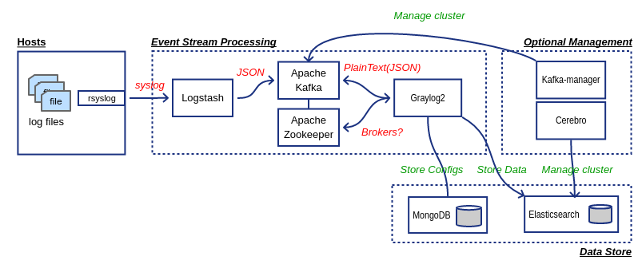

## 3.1. Apache Kafka 클러스터  

Logstash는 유입된 syslog 데이터를 Apach Kafka의 syslog 토픽(Topic)에 전달하도록 설정되어져있다. 따라서 Apach Kafka에 필요한 토픽을 생성해주어야한다.

> Apache Kafka는 기본적으로 자동으로  토픽을 생성하는 기능이 활성화되어있으나 제공된 설정에서는 이 기능을 비활성화 해두었다. 이는 보안성 측면을 고려한 설정으로 아무나 토픽을 생성하여 데이터를 전송하지 못하기위한 생각이 반영되어있는 부분이다. 
>
> 만일 자동 생성이 필요하다면 `KAFKA_AUTO_CREATE_TOPICS_ENABLE: ${KAFKA_AUTO_CREATE_TOPIC:-false}` 설정 부분을 주석처리하거나 `export KAFKA_AUTO_CREATE_TOPIC=true` 커맨드로 환경 변수를 선언한 후 다시 시스템을 기동시키면 된다. 토픽 자동 생성 기능을 활성화 할 수 있다. 

### 기본 제공되는 kafka CLI를 통한 토픽 생성

`/opt/kafka/bin/kafka-topics.sh` 커맨드를 통하여 `syslog` 토픽을 생성해준다.

> 여기서는 예를 들어 파티션과 복제수를 결정하였음
>
> https://kafka.apache.org/documentation/#topicconfigs

```bash
docker exec -it $(docker ps |grep "wurstmeister/kafka" | awk '{print $1}') "bash"

bash-4.4# JMX_PORT= /opt/kafka/bin/kafka-topics.sh --create --zookeeper=$KAFKA_ZOOKEEPER_CONNECT --topic=syslog --partitions=3 --replication-factor=1
Created topic "syslog".
```

### 3.2 Kafka-manager를 통한 토픽 생성

#### 3.2.1. 클러스터(Cluster) 생성
kafka-manager를 통하여 토픽을 생성하기위해서는 먼저 클러스터를 생성해 주어야 한다.

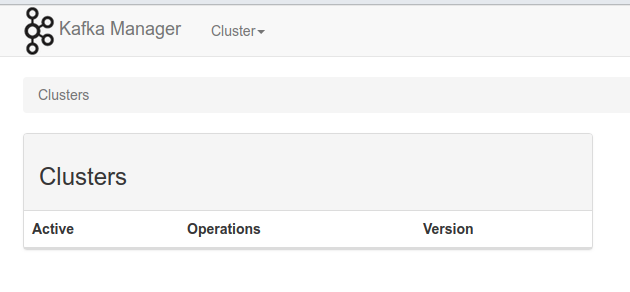

> 다음 그림은 Docker compose를 통하여 시스템 구성이 된 상태여서, Cluster Zookeeper Hosts에 zookeeper:2181 만 설정되었음 
> Swarm을 통한 구성 경우, Zookeeper Ensemble 맴버를 모두 넣어주어야 함
> (예) zoo1:2181,zoo2:2181,zoo3:2181

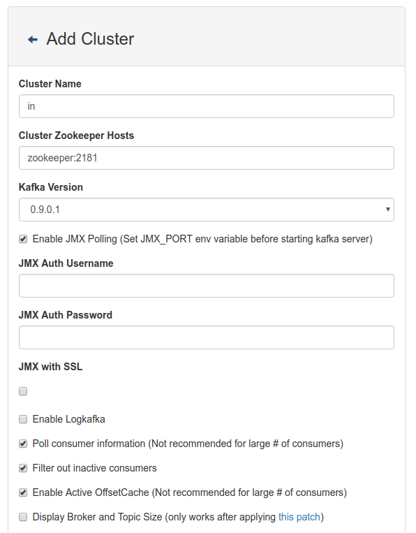

#### 3.2.2. 토픽(Topic) 생성
클러스터가 생성되었다면 이제 토픽을 생성해야한다.
먼저 생성된 클러스터를 선택하고 해당 메뉴를 클릭하여 토픽을 생성한다.

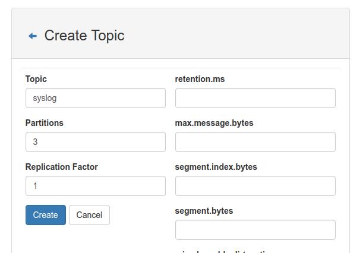

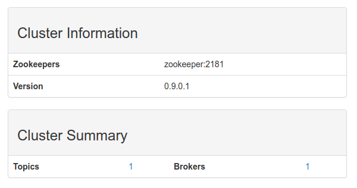

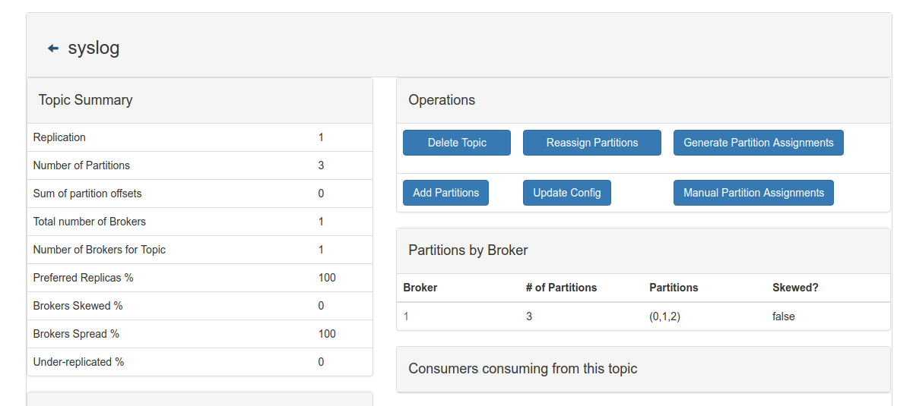

## 3.2. Logstash 재기동
실질적으로 Logstash는 문제 발생 시 데몬이 자동으로 재시도하도록 되어 특별히 이 항목을 수행할 필요가 없으다. 하지만 만일 문제가 발생하거나 특별한 경우 다음과 같이 재기동가능하다.

* Docker compose
```
docker-compose restart logstash
```
* Docker Swarm
`docker stack`을 통한 Logstash 구동한 경우, 다음과 같이 Logstash 서비스만 강재 재시작을 해줄 수 있다. 
```
docker service update --force logstash_logstash
```

## 3.3. Graylog2 설정

Graylog2는 syslog로 직접 로그 메시지를 받을 수 있다. 하지만 시스템이 다운되거나 비정상적  동작 시 데이터 유실의 염려가 있기때문에 Ingest와 Graylog2 사이에 고가용성이 확보되는 Apache Kafka와 같은 메시지 버퍼 시스템을 사용할 수 있다. 

우리는 목표를 다음과 같이 설정하고 진행을 할 것이다. 

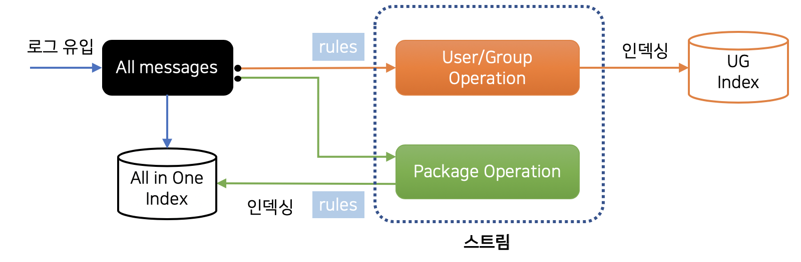

Graylog2는 컨텐츠팩(Content Pack)이라 부르는 JSON형태의 파일을 가져오기 또는 내보내기 기능을 제공한다.

이 하나의 컨텐츠팩에는 All in one 설정과 같이 입력(Input), 추출기(Extractor), 스트림(Stream), 대시보드(Dashboard)등의 설정이 포함될 수 있다.

먼저 간단히 Graylog2의 메시지 처리 흐름을 확인해보자. 
우리는 Kafka의 syslog 토픽으로부터 메시지를 받을 것이기 때문에 다음과 같은 과정이 진행되어져야한다.

1. 실제 메시지를 받기위한 Input 설정 
2. Input으로부터 받은 메시지에 대한 Filter 설정
3. 처리된 메시지를 저장하는 Output 설정 

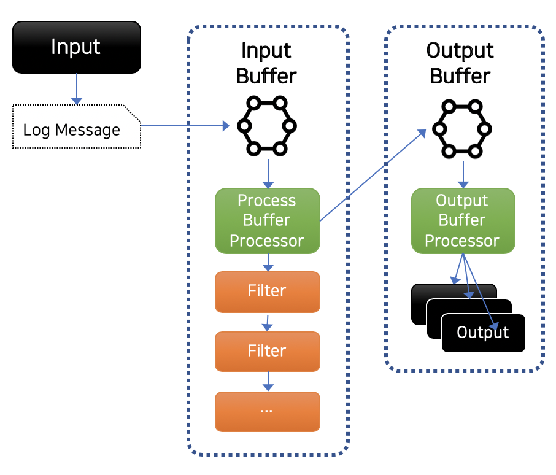

### 3.3.1. Content Pack을 통한 기본 설정 
http://docs.graylog.org/en/2.4/pages/sending_data.html#content-packs

Graylog2 는 각각의 설정들을 하나의 파일로 배포할 수 있는 기능을 제공하는데, 이를 Content pack이라 부른다.

Content pack 파일은 JSON 포맷을 통해 설정되어지며 다음과 같은 형태를 가진다. 

```
{
  "name": "Sample",
  "description": "Sample Content pack",
  "category": "Linux",
  "inputs": [],
  "streams": [],
  "outputs": [],
  "dashboards": [],
  "grok_patterns": [],
  "lookup_tables": [],
  "lookup_caches": [],
  "lookup_data_adapters": []
}

```

위 여러 단계의 작업을 쉽게 구현하기위해 본 저장소에서는 이미 동작가능한 content pack 파일을 포함하고 있다.

* graylog2/contentpack/kafka_syslog.json

이 파일을 열어보면 위와 같은 구조로 되어있는데 이는 위 그림에서 보인 우리의 목표를 달성하기위한 대부분의 들어있다.

이 단계에서는 웹 인터페이스를 이용하지 않고 간단히 Content pack 적용할 수 있는 스크립트를 통하여 Graylog2에 설정할 것이다. 

이제 다음과 같이 실행하도록 한다.

```bash
./graylog2/scripts/upload_contentpack.sh ./graylog2/contentpack/kafka_syslog.json
```

> 위 명령을 수행하기 위해서는 jq 커맨드가 필요하다. 

성공적으로 명령이 수행되었다면 `Applied contentpack` 이라는 문구가 표시될 것이다. 그러면 Graylog2에도 다음과 같은 화면을 표시할 것이다.

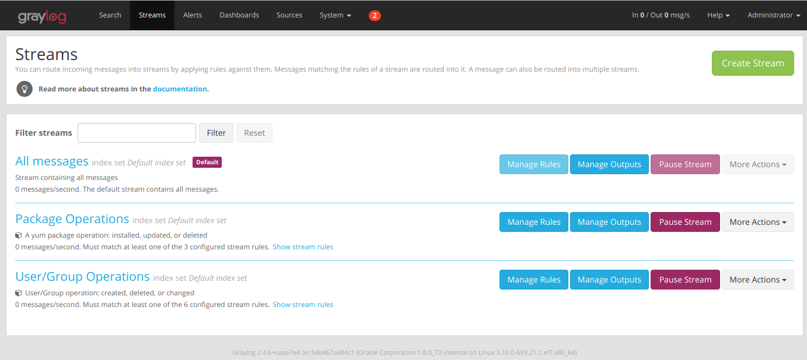

이 Content pack은 다음과 같은 설정이 포함되어있다.

* Apache Kafka의 syslog 토픽으로부터 메시지 풀링
* 가져온 메시지로부터 필요한 필드 추출 및 생성
* 특정 Stream rule을 기반으로하는 Stream rule 생성
* 특정 검색 쿼리를 통한 대시보드 생성

자세한 사항은 Content pack 코드 혹은 웹 인터페이스를 통하여 확인하도록 한다.

### 3.3.2. Index model 생성 및 적용
http://docs.graylog.org/en/2.4/pages/configuration/index_model.html

아직까지는 Content pack으로는 Index model을 생성할 수 없는 관계로 API나 웹 인터페이스를 통하여 설정해야 한다.

이번에도 역시 웹 인터페이스 대신 스크립트를 통하여 Graylog2에 설정할 것이다. 

```
./graylog2/scripts/upload_indexset.sh graylog2/indices/accesslog.json 
```

정상적으로 업로드가 되었다면 `Applied contentpack` 메시지가 출력될 것이다.

이제 웹 인터페이스로 들어가 index set을 확인해 본다

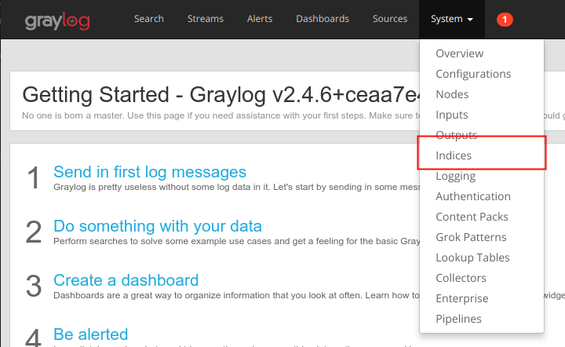

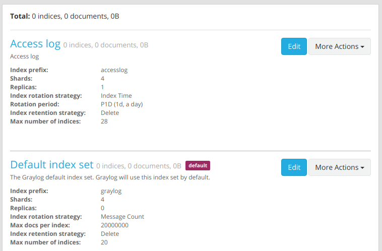

위와 같이 Default index set과 새로 생성한 Access log 라는 index set이 설정되어있는 것을 확인할 수 있다. 

### 3.3.3. Stream의 index set 설정

로그 관리 시 중요 로그는 일반 로그와 달리 더욱 오래 보관해야하거나 유실로부터 특히 유의해야하는 경우가 생기게 된다. 이를 Graylog2에서는 위의 index set을 통하여 이를 구현할 수 있다.

조금 전 생성한 Access log 는 기본 Default index set 에 비하여 보관 주기와 복제수가 높게 설정되어있다. 이를 User/Group Operation이라는 스트림에 설정해보도록 한다.

웹 인터페이스를 통하여 설정할 경우 다음과 같다.

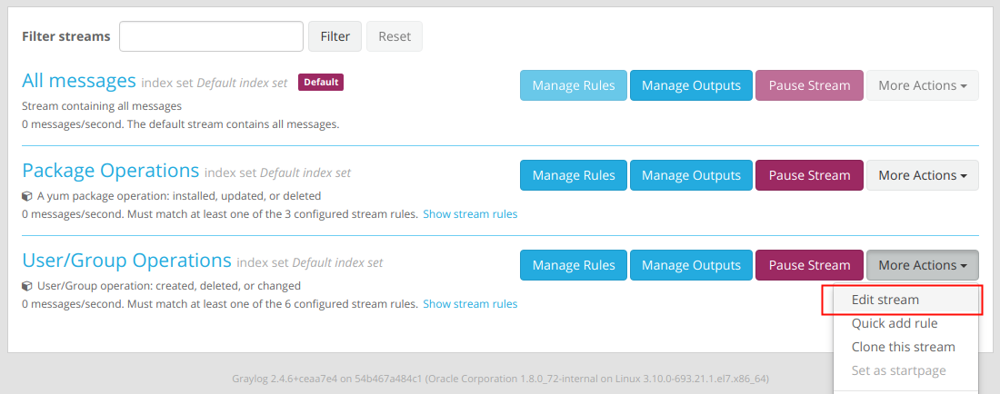

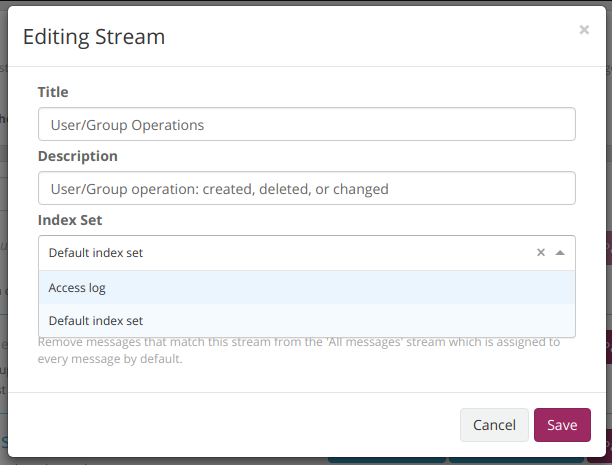

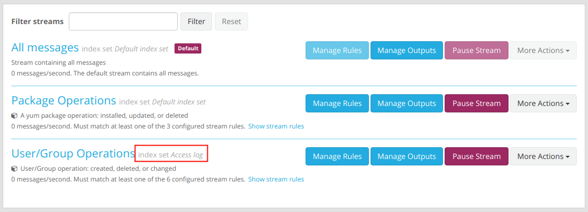

위 결과와 같이 User/Group Operations는 다른 로그 보관 주기 및 보제수로 로그가 저장되게된다.

# 4. 로그 전송 설정

http://docs.graylog.org/en/2.4/pages/sending_data.html#sending-syslog-from-linux-hosts

지금부터 syslog를 수집할 수 있는 기반이 마련되었으니 이제 수집을 원하는 시스템으로부터 로그를 받을 있도록 설정을 하면된다.

rsyslog를 로그 데몬으로 사용할 경우 간단히 /etc/rsyslog.conf 에 다음라인 추가로 원하는 목적을 이룰 수 있다.

```
*.*							@<IP or Domain FQDN>
```

# 5. 모니터링 구현

별도 페이지를 통해 추후 업데이트 예정