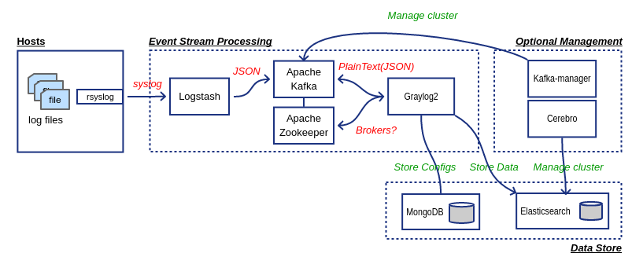

# About
Docker Compose 를 통하여 Graylog2 기능을 확인하고자 할 때 사용

# Component

 

# Preparation

## OS setting
### vm.max_map_count 증가
다음 설정을 적용하지 않을 경우, 컨테이너가 실행되지 않을 수 있으니 반드시 설정할 수 있도록 한다. 자세한 사항은 [Reference Document](https://www.elastic.co/guide/en/elasticsearch/reference/5.6/docker.html)를 참조할 것.
```bash
cat <<EOF > /etc/sysctl.d/20-vm-max-map-count.conf 
vm.max_map_count=262144
sysctl -p
```

## MaxMind GeoLite2 Database

Graylog2에서 IP의 위치 정보를 사용하기 위해 다음 URL에서 GeoLite2 City Database를 다운로드 받은 후 graylog2/GeoLite2-City 디렉토리에 GeoLite2-City.mmdb 파일을 위치 시킨다.

* [다운로드 링크](https://dev.maxmind.com/geoip/geoip2/geolite2/)

```bash
wget http://geolite.maxmind.com/download/geoip/database/GeoLite2-City.tar.gz -O /tmp/GeoLite2-City.tar.gz
tar zxvf /tmp/GeoLite2-City.tar.gz --strip 1 -C ./graylog2/GeoLite2-City
```

## Start containers
### GRAYLOG2 Web listen URI
Graylog2는 REST API 주소에 사용할 URL 정보를 docker  compose에 전달하기 위해 다음 커맨드를 실행한다.  자세한 사항은 [web_interface](http://docs.graylog.org/en/2.4/pages/configuration/web_interface.html)를 참조한다.

```bash
HOST_IP=$(ip addr show $(/sbin/ip route | awk '/default/ { print $5 }') | grep -Eo '[0-9]{1,3}\.[0-9]{1,3}\.[0-9]{1,3}\.[0-9]{1,3}' | head -1)
GRAYLOG_WEB_ENDPOINT_URI="http://${HOST_IP}:9000/api"
```

```bash
docker-compose up -d
```

## ETC.

### Elasticsearch node scaling
`docker compose up --scale` 명령으로 Elasticsearch 의 replica를 조정할 수 있다.
다음 명령은 Elasticsearch 노드를 3개까지 증가시킨다.
```bash
docker-compose up --scale elasticsearch=3
```

## 접속 정보 
### Kibana 접속 정보
- http://localhost:5601

### Cerebro 접속 정보
> Graylog2의 Web binding port와 곂치는 관계로 9000 -> 9100으로 변경처리
- http://localhost:9100
접속 시 ES URL을 물어볼 경우 다음과 같이 입력한다.
- http://elasticsearch:9200

## Clean up containers
다음 명령을 사용하면 사용중인 모든 컨테이너 및 볼륨들을 삭제한다.
```bash
docker-compose down -v
```
